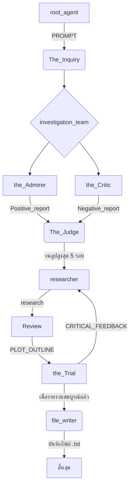

# ภาพรวม Workflow ของ Agent

ไฟล์ `agent.py` นี้ได้สร้างเวิร์กโฟลว์แบบหลายเอเจนต์ (multi-agent) ที่ซับซ้อนขึ้นมาเพื่อวิเคราะห์บุคคลหรือเหตุการณ์ทางประวัติศาสตร์ในรูปแบบของการไต่สวนจำลอง โดยมีเป้าหมายเพื่อสร้างรายงานที่เป็นกลางและสมดุลจากข้อมูลทั้งด้านบวกและด้านลบ

## โครงสร้างของ Agent

เวิร์กโฟลว์ประกอบด้วยเอเจนต์หลักๆ ที่ทำงานร่วมกันดังนี้:

1.  **`root_agent`**:
    *   **หน้าที่**: เป็นเอเจนต์เริ่มต้น ทำหน้าที่ต้อนรับผู้ใช้และสอบถามเกี่ยวกับบุคคลหรือเหตุการณ์ทางประวัติศาสตร์ที่ต้องการวิเคราะห์
    *   **การทำงาน**: เมื่อได้รับข้อมูลจากผู้ใช้ จะบันทึกข้อมูลนั้นลงใน state ที่ชื่อว่า `PROMPT` แล้วส่งต่อไปให้ `The_Inquiry` agent

2.  **`The_Inquiry` (SequentialAgent)**:
    *   **หน้าที่**: จัดการลำดับการทำงานหลักทั้งหมด
    *   **การทำงาน**: เรียกใช้ sub-agents ตามลำดับดังนี้:
        1.  `investigation_team`
        2.  `The_Judge`
        3.  `file_writer`

3.  **`investigation_team` (ParallelAgent)**:
    *   **หน้าที่**: รวบรวมข้อมูลเบื้องต้นทั้งด้านบวกและลบ
    *   **การทำงาน**: เรียกใช้ 2 sub-agents ให้ทำงานพร้อมกัน:
        *   **`the_Admirer`**: ค้นหาและรวบรวมเฉพาะความสำเร็จและแง่มุมเชิงบวก แล้วบันทึกผลลัพธ์เป็นรายการลงใน `Positive_report`
        *   **`the_Critic`**: ค้นหาและรวบรวมเฉพาะแง่มุมเชิงลบและประเด็นถกเถียง แล้วบันทึกผลลัพธ์เป็นรายการลงใน `Negative_report`

4.  **`The_Judge` (LoopAgent)**:
    *   **หน้าที่**: วนลูปเพื่อปรับปรุงและขัดเกลารายงานให้มีความสมดุลและเป็นกลางที่สุด
    *   **การทำงาน**: วนซ้ำการทำงานของ sub-agents 3 ตัว (สูงสุด 5 รอบ) เพื่อพัฒนารายงานฉบับร่าง (`PLOT_OUTLINE`):
        1.  **`researcher`**: ใช้ Wikipedia เพื่อค้นคว้าข้อมูลเพิ่มเติมเพื่อยืนยันหรือขยายความประเด็นที่พบใน `Positive_report` และ `Negative_report` รวมถึงหาข้อมูลเพื่อตอบ `CRITICAL_FEEDBACK` ผลการค้นคว้าจะถูกเก็บใน `research`
        2.  **`Review`**: เขียนหรือปรับปรุง `PLOT_OUTLINE` โดยพิจารณาจากข้อมูลทั้งหมดที่มี (`Positive_report`, `Negative_report`, `research`, `CRITICAL_FEEDBACK`) เพื่อสร้างเรื่องราวที่เป็นกลางและสมดุล
        3.  **`the_Trial`**: ประเมิน `PLOT_OUTLINE` ว่ามีความเป็นกลาง สมดุล และถูกต้องตามข้อเท็จจริงหรือไม่ หากรายงานดีแล้วจะสั่งให้หยุดการวนซ้ำ (exit loop) แต่หากยังต้องปรับปรุง จะสร้างข้อเสนอแนะเก็บไว้ใน `CRITICAL_FEEDBACK` เพื่อให้ `researcher` และ `Review` นำไปใช้ในรอบถัดไป

5.  **`file_writer`**:
    *   **หน้าที่**: เป็นเอเจนต์สุดท้ายในกระบวนการ ทำหน้าที่บันทึกผลลัพธ์ทั้งหมดลงไฟล์
    *   **การทำงาน**: นำข้อมูลสุดท้ายจาก `PLOT_OUTLINE`, `Positive_report`, และ `Negative_report` มาจัดรูปแบบและบันทึกเป็นไฟล์ `.txt` ในไดเรกทอรี `Judge_Fact`

## แผนภาพการทำงาน

